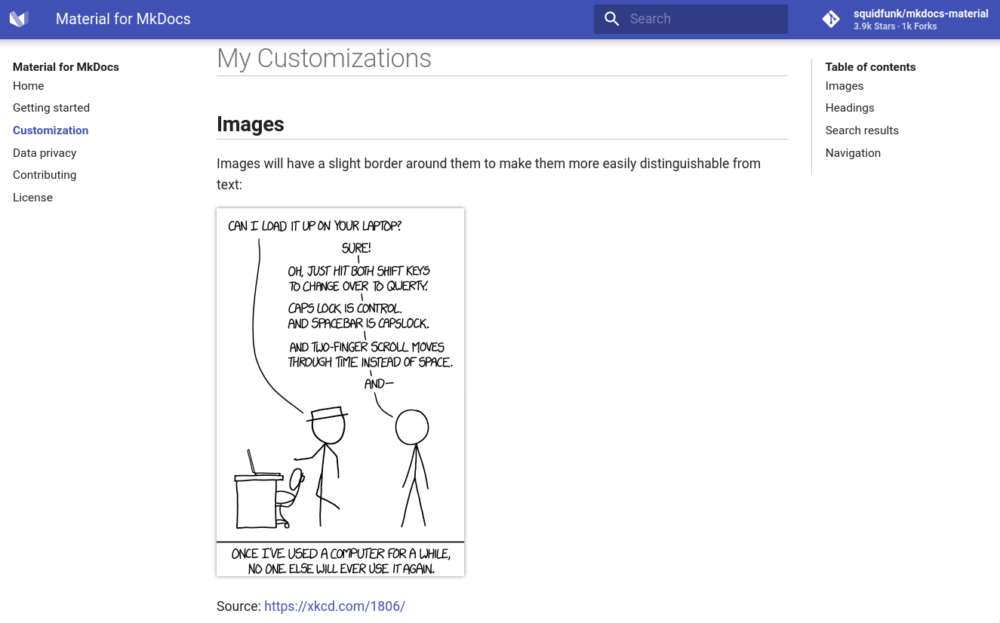

# My personal [`mkdocs-material`](https://squidfunk.github.io/mkdocs-material/) visual enhancements


While the [mkdocs-material theme](https://github.com/squidfunk/mkdocs-material) is very beautiful, I personally found it a bit too less on contrast and difficult to visually distinguish elements. Therefore, I created some `CSS` and `JavaScript` customizations with the goal of finding content as fast as possible while not making to much compromises on aesthetics.


## CSS

**I did the following `CSS` customizations to make `mkdocs-material` fit _my_ specific needs:**

1. I disabled the footer element for "next" and "previous" page.
2. I changed the hover effect on elements in the navigation list and in the TOC to highlight the background of an entry rather than just the text (and also deleted the gap between the hitboxes of the links). Additionally, the active entry is now bold.
3. I highlighted words in the search results to quickly see where the keyword appears in the previewed text.
4. I underlined H1 and H2 headlines to quickly und distinguish different sections while scrolling (fastly) through a page.
5. I changed H2 and H3 to bold, again to make different sections more distinguishable while scrolling (fastly) through a page.
6. I created a thin vertical line between the page content and the TOC to more easily detect the boundaries of a page


### Images

Images have a thin border which I found helps to visually recognize the boundaries of an image more easily, especially when the image contains text and has a white background.

_**Screenshot:**_




### Search results

Searched keywords inside the search results preview are highlighted. This makes scanning through search results very quick.


## JavaScript

The JavaScript customization just includes opening the "modify page" link (link to GitHub/GitLab/Gitea/... Editor) in a new tab. While this is usually a pretty easy task, it takes some more code to make it also work for [instant loading](https://squidfunk.github.io/mkdocs-material/getting-started/#instant-loading) via `XMLHttpRequest`s.


## How to use

1. Paste the `extra` folder of this repository inside your `docs` directory.
2. Add the following lines inside your `mkdocs.yml`:
    ```yml
    extra_css:
    - extra/styles.css
    extra_javascript:
    - extra/javascript.js
    ```

## That's ugly as ***!

The goal was not to make `mkdocs-material` prettier but to make it easier to find content faster, especially when you use it very frequently as a (personal) knowledge base. I personally still find it pretty decently looking with some UX enhancements. Nobody is obliged to use it (not all people are equally pendantic about this).
